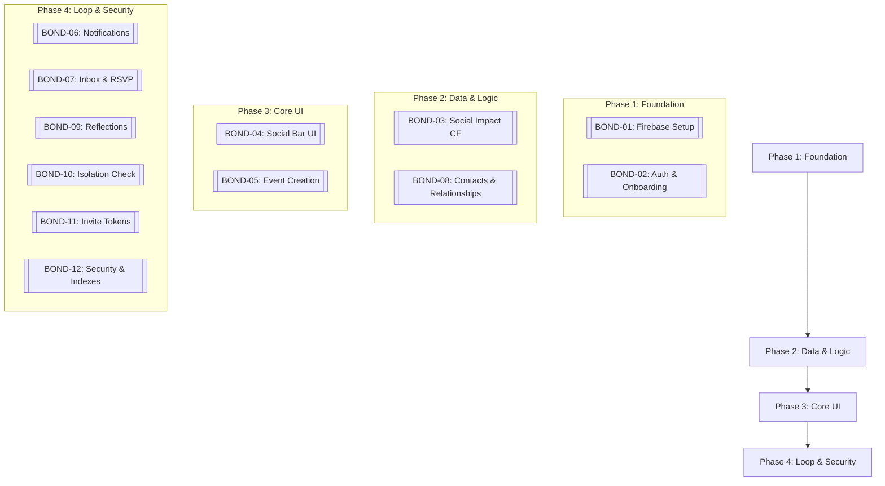

# BondConnect: Implementation Roadmap

This roadmap defines the recommended sequence for building the BondConnect Phase 1 MVP. The work is divided into four logical phases, each with a clear focus and set of Trello card dependencies.

---

## 🗺️ Phase Overview

---

## 📅 Sprint Schedule (Recommended)

### Sprint 1: The Foundation
*Goal: Enable developers to join the project and allow users to create an account.*
- **BOND-01: Firebase Project Setup** (Backend)
- **BOND-02: Auth + User Onboarding** (Full-stack)
- **BOND-03: calculateSocialImpact Cloud Function** (Backend) - *Start early due to complexity*

### Sprint 2: Relationship & Logic
*Goal: Define who the users are interacting with and how it impacts their bar.*
- **BOND-08: Contacts List + Relationship Schema** (Full-stack)
- **BOND-04: Social Bar UI — Home Dashboard** (Frontend)
- **BOND-12: Firestore Security Rules + Indexes** (Backend) - *Ensure a secure baseline*

### Sprint 3: Interaction & Preview
*Goal: Allow users to propose events and see their impact.*
- **BOND-05: Event Creation Form + Impact Preview** (Full-stack)
- **BOND-06: onEventCreated CF + FCM Notifications** (Backend)
- **BOND-11: Invite Tokens + Deep Linking** (Backend)

### Sprint 4: The Feedback Loop
*Goal: Complete the social cycle with RSVPs and reflections.*
- **[BOND-07: Inbox + RSVP Flow UI](specs/BOND-07-inbox-rsvp.md)** (Frontend)
- **[BOND-09: Post-Event Reflection + Pm Nudge](specs/BOND-09-post-reflection.md)** (Full-stack)
- **[BOND-10: onIsolationCheck CF + Isolation Drain](specs/BOND-10-isolation-check.md)** (Backend)

---

## 📊 Effort Breakdown

| Sprint | Cards | Total Days |
|:---|:---|:---|
| Sprint 1 | BOND-01, BOND-02, BOND-03 | 6 days |
| Sprint 2 | BOND-08, BOND-04, BOND-12 | 5 days |
| Sprint 3 | BOND-05, BOND-06, BOND-11 | 7 days |
| Sprint 4 | BOND-07, BOND-09, BOND-10 | 6 days |
| **Total** | **12 cards** | **24 days** |

---

## 🚦 Critical Path
The most critical sequence for the product's unique value proposition is:
**BOND-01** ➡️ **BOND-02** ➡️ **BOND-03** ➡️ **BOND-04** ➡️ **BOND-05**

*If this sequence is delayed, the core "Social Bar" experience cannot be validated.*

---

## 🛠️ Parallel Work
Multiple developers can work in parallel on the following tracks once Phase 1 is complete:
1. **Frontend Track**: BOND-04 (Home) ➡️ BOND-07 (Inbox)
2. **Backend Track**: BOND-10 (Isolation) ➡️ BOND-11 (Tokens) ➡️ BOND-12 (Security)
3. **Full-Stack Track**: BOND-02 (Auth) ➡️ BOND-08 (Contacts) ➡️ BOND-05 (Events) ➡️ BOND-09 (Reflections)
